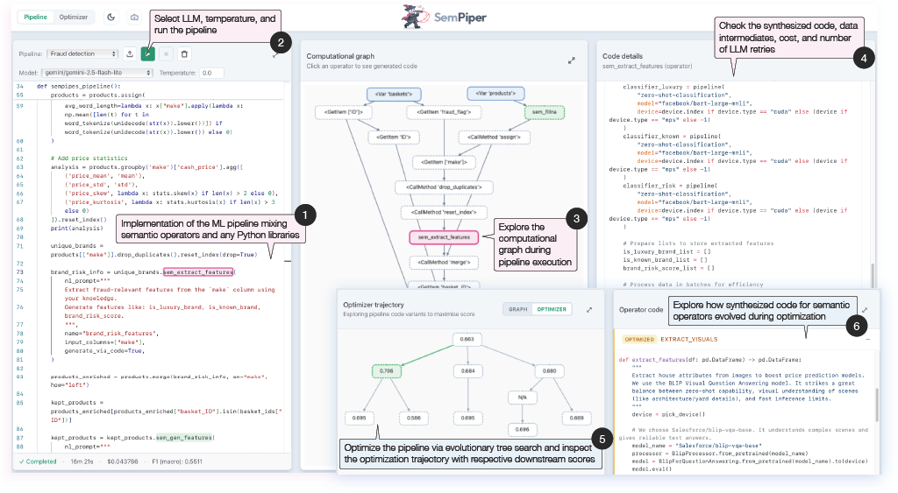

<p align="center">
  
</p>


**SemPiper** consists of a **three-panel layout**:

1. **Left — Pipeline editor**  
   Editor for writing Python code as declarative pipelines using SemPipes. The code is the source of truth; changes drive compilation and graph updates.

2. **Middle — Interactive graph**  
   Visualisation of the **scrub-compiled graph** (pipeline DAG). Nodes are clickable; selecting a node drives the content shown in the right panel.

3. **Right — Node details / results**  
   Contextual content for the **selected graph node**:
   - **Input nodes**: data summary (schema, sample, stats).
   - **SemPipes / operator nodes**: generated code, LLM prompt statistics, or other node-specific metadata.

SemPiper is a demo for [SemPipes](https://github.com/deem-data/sempipes/tree/main): FastAPI backend + React frontend. Dependencies: **Poetry** (`pyproject.toml` only; no `requirements.txt`). SemPipes is a local path dependency via `sempipes/` symlink.

 

## Repository layout

```
sempiper/
├── demo/
│   ├── backend/           # FastAPI (main:app), port 8000
│   └── frontend/          # React + Vite, port 5173
├── pipeline_scripts/      # Example pipelines (manifest.json)
├── optimizer_scripts/     # Optimizer example scripts
├── sempipes/              # Symlink → external sempipes repo (read-only here)
├── pyproject.toml         # Python dependencies (root)
├── Makefile               # run, stop, test
└── logs/                  # Runtime logs (created by make run)
```

API and demo app details: [`demo/README.md`](demo/README.md).

## Requirements

- Python 3.11–3.12
- [Poetry](https://python-poetry.org/)
- Node.js + npm
- Clone of [sempipes](https://github.com/deem-data/sempipes/tree/main)

## Setup

### 1. Symlink SemPipes

```bash
cd /path/to/parent
git clone https://github.com/deem-data/sempipes.git sempipes

cd /path/to/sempiper
ln -s ../sempipes sempipes   # or ln -s /absolute/path/to/sempipes sempipes
```

Do not edit files under `sempipes/` in this repo.

### 2. Install dependencies

```bash
# Repo root — Python (includes sempipes from symlink)
poetry install

# Frontend
cd demo/frontend && npm install
```

### 3. Environment (for pipeline execution with LLM operators)

Create `.env` at the repo root with your provider keys, e.g. `OPENAI_API_KEY`, `GEMINI_API_KEY`. The backend loads it on startup.

## Run

```bash
make run    # backend :8000, frontend :5173 (background)
make stop
```

Open **http://localhost:5173**.

Manual:

```bash
cd demo/backend && poetry run uvicorn main:app --reload
cd demo/frontend && npm run dev
```

Docker (from repo root):

```bash
docker compose -f demo/docker-compose.yml up --build
```

## Tests

| Command | Location | Description |
|---------|----------|-------------|
| `make test` | repo root | Backend + frontend (parallel), then E2E |
| `make test-backend` | repo root | `pytest` in `demo/backend` |
| `make test-frontend` | repo root | Vitest in `demo/frontend` |
| `make test-e2e` | repo root | Playwright |
| `make verify-compile` | repo root | Live compile edge check (requires `make run`) |

Backend only: `cd demo/backend && poetry run pytest tests/ -v`

## Lint and format

**Python** (from repo root; `demo/` only, `sempipes/` excluded):

```bash
poetry run ruff check demo/
poetry run ruff format --check demo/
poetry run mypy demo/backend
poetry run pre-commit install
poetry run pre-commit run --all-files
```

**Frontend** (`demo/frontend`):

```bash
npm run lint
npm run lint:fix
npm run format
npm run format:check
```

## Logging

`make run` writes timestamped logs under `logs/`:

| File | Contents |
|------|----------|
| `logs/backend-*.log` | Uvicorn/FastAPI: HTTP, compile/execute lifecycle |
| `logs/frontend-*.log` | Vite dev server |
| `logs/runners/runner-*-<PID>.log` | Full subprocess stdout/stderr per `/api/execute` run |

The backend log records one line per subprocess (PID, status, path to runner log). Use `logs/runners/runner-*.log` to debug failed pipeline runs.

## Citation

If you use **SemPiper** or **SemPipes**, please cite the corresponding paper.

**SemPiper** (VLDB demonstration):

```bibtex
@article{ovcharenko2026sempiper,
  title   = {{SemPiper}: Interactive Code Synthesis for Semantic Operators in ML Pipelines},
  author  = {Ovcharenko, Olga and Duarte, Luciano and Schelter, Sebastian},
  journal = {Proceedings of the VLDB Endowment},
  year    = {2026},
  url     = {https://github.com/OlgaOvcharenko/sempipes-demo},
}
```

**SemPipes** (arXiv):

```bibtex
@misc{ovcharenko2026sempipesoptimizablesemantic,
  title         = {SemPipes -- Optimizable Semantic Data Operators for Tabular Machine Learning Pipelines},
  author        = {Olga Ovcharenko and Matthias Boehm and Sebastian Schelter},
  year          = {2026},
  eprint        = {2602.05134},
  archivePrefix = {arXiv},
  primaryClass  = {cs.LG},
  url           = {https://arxiv.org/abs/2602.05134},
}
```
